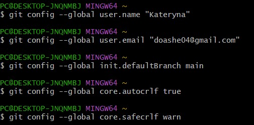
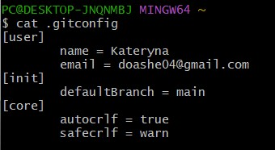

# repo1
"Вивчення Git"
Мета: Опанувати базові команди та принципи роботи з системою контролю версій Git, шляхом проходження курсу на githowto.com.

1. Найперше, що повинно бути виконано це декілька команд, щоб Git дізнався ім'я та електронну пошту. Ці дані використовуються для підпису змін, що дозволить відстежувати, хто і коли зробив зміни в файлі.

Третій рядок - налаштовання початкової гілки за замовчуванням, в цьому випадку це main.

Четвертий рядок - забезпечує автоматичну конвертацію кінцівок рядків між форматами CRLF і LF під час коміту і checkout, щоб зробити їх однорідними у репозиторії, особливо у крос-платформних проєктах.

П’ятий рядок - встановлює Git на попередження про потенційні проблеми з кінцівками рядків (змішані кінцівки), що може допомогти уникнути проблем з файлом у репозиторії.

Ці конфігурації допомагають забезпечити узгодженість форматів кінцівок рядків у репозиторії та попередити можливі проблеми під час роботи з файлами на різних операційних системах.

