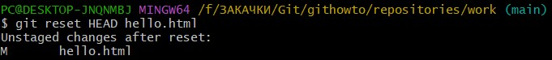
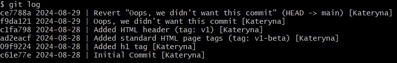

# Git
"Вивчення Git"

Мета: Опанувати базові команди та принципи роботи з системою контролю версій Git, шляхом проходження курсу на githowto.com.

1. Найперше, що повинно бути виконано це декілька команд, щоб Git дізнався ім'я та електронну пошту. Ці дані використовуються для підпису змін, що дозволить відстежувати, хто і коли зробив зміни в файлі.

Перший рядок про ім’я.

Другий рядок про пошту.

Третій рядок - налаштовання початкової гілки за замовчуванням, в цьому випадку це main.

Четвертий рядок - забезпечує автоматичну конвертацію кінцівок рядків між форматами CRLF і LF під час коміту і checkout, щоб зробити їх однорідними у репозиторії, особливо у крос-платформних проєктах.

П’ятий рядок - встановлює Git на попередження про потенційні проблеми з кінцівками рядків (змішані кінцівки), що може допомогти уникнути проблем з файлом у репозиторії.

Ці конфігурації допомагають забезпечити узгодженість форматів кінцівок рядків у репозиторії та попередити можливі проблеми під час роботи з файлами на різних операційних системах.

Команда cat .gitconfig використовується для виведення вмісту файлу .gitconfig.

2. Створення проєкту

Для початку створюємо порожню піддиректорію work:

потім переходимо до неї: 

та створюємо файл hello.html:

Відкриваємо файл у редакторі nano:

І вводимо вміст «Hello, World».

Наразі є директорія з одним файлом. Для того щоб створити Git-репозиторій з цієї директорії, слід виконати команду git init:

Повідомлення каже про успішне створення Git-репозиторію.

Далі додаємо в репозитарій сторінку «hello.html»:

Потім створюємо коміт, -m дозволяє вказати повідомлення коміту — "Initial commit":

Слідом випливає повідомлення:
main: назва гілки. За замовчуванням, перша гілка у Git називається main.

(root-commit): вказує на те, що цей коміт є кореневим комітом (root commit), тобто першим комітом в історії цього репозиторію.

с61е77е:  перші сім символів хешу коміту (унікальний ідентифікатор коміту).

1 file changed: Вказує, що один файл (hello.html) був змінений або доданий.

3. Перевірка стану

Щоб дізнатися поточний стан репозиторія потрібно використовувати команду git status:

Команда перевірки стану повідомила, що комітити нема чого. Це означає, що у репозиторії вже зберігається поточний стан робочих файлів, та нема жодних змін, які б могли очікувати на запис.

4. Внесення змін

Відкриваємо файл у редакторі nano:

І змінюємо вміст:

Перевіряємо стан:

Файл було змінено, але ці зміни ще не зафіксовано у репозиторії.

5. Індексація змін

Наступним кроком буде дати команду Git проіндексувати зміни і слідом перевірити стан:

Повідомлення нам переказує, що зміни файлу hello.html було проіндексовано. Тобто Git знає про зміни.

7. Коміт змін

Тепер зробімо коміт того, що проіндексували у репозиторій.

Вводимо команду git commit, але без –m як це було раніше. Тоді нас переносить у редактор:

У першому рядку вводимо коментар Added h1 tag. Зберігаємо і виходимо:

Далі перевіряємо стан:

Бачимо що директорія чиста.

8. Зміни, а не файли

Знову змінюємо вміст файлу:

Тепер додаємо ці зміни в індекс Git:

І знову змінюємо файл, додаючи заголовок:

Перевіряємо статус:

Повідомлення показує що файл згадано двічі. Перша зміна проіндексована і готова до коміту. Друга зміна (де додали заголовки) є непроіндексована.

Якби зараз було зроблено коміт, заголовки не було б збережено у репозиторій. Це можна перевірити.

Робимо коміт проіндексованих змін і ще раз перевіряємо стан:

Команда статусу повідомляє, що у файлі досі є незбережені зміни.

Додаємо другу зміну в індекс (перший рядок означає що було використано поточну директорію) і знову перевіряємо стан:

Тепер ми бачимо що другу зміну було проіндексовано й приготовлено до коміту.
Тому далі робимо коміт цієї ж другої зміни:

9. Історія проєкту

За допомогою наступної команди можна отримати список зроблених змін:

Наступна команда відображає однорядковий формат:

Ще декілька варіантів для перегляду історії:

Історія за останній тиждень:

Для того щоб зберегти формат перегляду історії вводимо команди:

10. Отримання старих версій

Використовуємо хеш першого коміту в наступній команді:

Повернімося до останньої версії коду, перемикаючись на гілку за замовчуванням main, за допомогою команди нижче, і перевіримо вміст файлу:

11. Створення тегів версій

Створимо тег поточної версії:

Потім тег для версії, що передує поточній. Але спершу перемкнемося на попередню версію. Замість пошуку хеша коміта, використаємо ^, а саме v1^, що вказує на коміт, попередній до v1:

Це версія яка без заголовка. Позначемо її як v1-beta:

Тепер спробуємо перемикатися між двома версіями:

Подивитись які теги доступні можна використовуючи команду нижче:

Також можна подивитися їх за допомогою команди для виведення списку комітів:

Повідомлення показує теги у лозі разом з ім’ям гілки. Позначка HEAD показує коміт на який ми перемкнулися.

12. Скасування локальних змін (до індексації)

Спершу переконаємося, що перебуваємо на останньому коміті:

Знову змінемо вміст файла hello.html:

Перевіряємо стан:

І бачимо, що файл було змінено, але ще не проіндексовано.

Використаємо команду для перемикання checkout в версію файлу hello.html у репозиторії:

Статус показує, що в робочій директорії не було зроблено жодних незафіксованих змін. І «небажаний коментар» більше не є частиною вмісту файлу.

13. Скасування проіндексованих змін (перед комітом)

Насамперед внесемо зміни у файл hello.html у вигляді небажаного коментаря:

І проіндексуємо ці зміни:

Перевіряємо стан:

І бачимо, що зміни проіндексовано і готове до коміту.

Тепер скасуємо індексацію змін:

Команда reset відкочує область підготовки до HEAD. Це очищає область підготовки від змін, які були проіндексовані. Проте, через те що ця команда не змінює робочу директорію, робоча директорія все ще містить небажаний коментар.

Щоб видалити небажані зміни в робочій директорії використовуємо команду нижче:

Результат:

14. Скасування комітів

Знову змінюємо вміст файлу:

І робимо коміт:

Для скасування коміту, нам необхідно зробити коміт, що видаляє зміни, збережені небажаним комітом.

Вводимо git revert HEAD і переходимо до редактора:

Перевіряємо лог, що показує небажані та скасовані коміти у нашому репозиторії:

15. Видалення комітів з гілки (revert)

Перевіримо історю комітів:

Видалімо два останні коміти за допомогою команди reset.

Але спершу позначемо останній коміт тегом, для зручного пошуку:

Повідомлення логу показує, що коміт з тегом v1 є попереднім комітом до помилкового.

Скиньмо гілку до цієї точки. Оскільки гілка має тег, ми можемо використовувати ім'я тегу в команді відкоту reset (якщо вона не має тега, ми можемо використовувати хеш коміта).

--hard – параметр аби повністю скинути стан робочої директорії до того, як було вказано в зазначеному коміті (у цьому випадку, до тега v1).
В лозі бачимо що вже немає комітів "Revert Oops" і "Oops".

Але якщо ми подивимось на всі коміти то побачимо що помилкові коміти не зникли, вони просто відсутні в гілці main:

16. Видалення тегу Oops

Після видалення більше не буде відображатися у репозиторії:

17. Внесення змін до комітів

Додаємо коментар у сторінку:

І робимо коміт:

Проте після створення коміту ми згадали про електронну пошту автора, яку не вписали, оновлюємо сторінку, додаючи email:

Змінимо попередній коміт, включивши в нього email:

І переглянемо історію для перевірки:

Бачимо як коміт змінений.

18. Створення гілки

Далі ми створемо нову гілку (для CSS) та одночасно перейдемо на неї:

Створемо файл:

І змінемо його вміст:

Потім змінемо вміст hello.html:

Наразі у нас є нова гілка (style) з двома новими комітами.

19. Перемикання гілок

Перевіримо в лозі:

Перемикаємося на гілку main і відображуємо вміст файлу hello.html:

Зараз ми знаходимося у гілці main і бачимо що у файлі hello.html немає style.css, бо ми їх не бачимо з гілки main.

Повертаємося до гілки style і відображуємо вміст файлу hello.html:

І ми бачимо шо наші зміни присутні.

20. Переміщення файлів

Перевіряємо історію змін окремо у файлі hello.html і у файлі style.css:

Команда show використовується для перегляду змін у конкретному коміті: 

diff --git a/hello.html b/hello.html - показує, що порівнюються дві версії файлу hello.html (до і після змін).

@@ -1,4 +1,6 @@ - показує контекст змін: починаючи з першого рядка, у старій версії було 4 рядки, а у новій - 6 рядків.

Рядки, позначені +, є новими і були додані в цьому коміті.

Наступним кроком буде перейменувати файл hello.html на index.html за допомогою стандартної команди mv:

Git розуміє цю зміну так, ніби файл було видалено і створено новий. Нам потрібно повідомити Git, що ми саме перейменували файл, а не видалили та створили новий. 

Але в простих ситуаціях Git сам зрозуміє, що файл було перейменовано, щойно ми додамо його до індексу:

Потім перемістимо наш файл style.css до директорії css, але цього разу зробимо це безпечно за допомогою команди git mv.

Ця команда гарантує, що переміщення буде записано в історії Git як переміщення:

Потім закомітимо та перевіримо історію змін у файлі css/styles.css. Нам потрібно буде додати опцію --follow, щоб побачити історію файлу до того, як він був переміщений:

21. Зміни в гілці main

Створимо файл README:

і впишемо в ньому наступне:

Далі треба закомітити файл README у гілку main, однак зараз ми перебуваємо у гілці style. Файл README не є частиною цієї гілки, тому перед комітом слід перейти до гілки main:

22. Перегляд розбіжних гілок

Тепер у репозиторії є дві гілки, що розходяться. За допомогою наступною командою log, можна побачити гілки і те, як вони розходяться:

Опція --all гарантує, що ми бачимо всі гілки, оскільки за замовчуванням у лозі показується тільки поточна гілка.

Опція --graph додає просте дерево комітів, зображене текстовими лініями. Ми бачимо обидві гілки (style і main) і те, що гілка main відмічена як HEAD, тобто вона є поточною. Спільним предком для обох гілок є гілка, у якій було внесено коміт «Added copyright statement with email».

23. Злиття

Злиття переносить зміни з двох гілок в одну. Повернемося до гілки style і зіллємо main із style:

І перевіряємо стан:

24. Створення конфлікту

Для початку повернімося до гілки main і впишемо зміни:

Переглянемо гілки:

Після коміту «Added README» гілка main була об'єднана з гілкою style, але зараз в main є додатковий коміт, що не був злитий із style. Також можемо побачити що остання зміна в main конфліктує з деякими змінами в style.

25. Вирішення конфліктів

Повернемося до гілки style і зіллємо туди всі нещодавні зміни з гілки main:

Повідомлення сповіщає про конфлікт.

Перевіряємо стан:

При відкритті index.html в редакторі випливає наступне:

Частина між <<<<<<< >>>>>>> є конфліктом. Секція зверху відповідає гілці style, що є поточною гілкою (або HEAD) репозиторія. Нижня секція відповідає змінам з гілки main. Git не може вирішити, які зміни застосовувати, тому просить розв'язати конфлікт вручну. 

Перш ніж розв'язувати конфлікт. Git дозволяє скасувати злиття і відновити попередній стан репозиторія. Для цього можна скористатися командою git merge --abort, як це було запропоновано командою status, яку щойно виконали:

Далі ще раз запустимо злиття:

Відредагуємо файл до стану, який нас влаштовує, а потім закомітимо його. У цьому випадку об'єднаємо зміни з обох гілок. 

Отже, редагуємо файл до наступного стану:

Зробимо коміт з розв'язаним конфліктом:

І подивимося на поточний стан нашого репозиторію і переконаємось, що все гаразд:

27. Відкочування гілки style

Слід повернутись у гілку style до точки перед тим, як ми злили її з гілкою main. Можемо відновити гілку до будь-якого коміту за допомогою команди reset.

У цьому випадку ми хочемо повернутися в гілці style в точку перед злиттям з main. Нам необхідно знайти останній коміт перед злиттям:

Повідомлення пише, що коміт «Renamed hello.html; moved style.css» був останнім у гілці style перед злиттям.

Далі скидаємо гілку style до цього коміту. Для посилання на цей коміт ми визначаємо, що цей коміт знаходиться за 2 коміти до HEAD, тобто HEAD~2 у нотації Git.

Тепер перевіримо історію змін у гілці style:

У ньому не повинно бути жодних комітів злиття.

28. Перебазування

Ми повернули гілку style до стану перед першим злиттям. В гілці main є дві коміти, яких зараз немає у гілці style: новий файл README і конфліктна зміна у файлі index.html. Цього разу треба перенести ці зміни до гілки style за допомогою команди rebase, а не merge.

Спершу перебазуємо гілку style на main:

Бачимо що знову виник конфлікт, що стався в hello.html, а не в index.html, як минулого разу. Це тому, що rebase був у процесі застосування змін style поверх гілки main. У той момент в гілці main ще не було перейменовано файл hello.html, тому він все ще має стару назву.

При злитті виник би "зворотній" конфлікт. Під час злиття зміни гілки main були б застосовані поверх гілки style. У гілці style файл перейменовано, тому конфлікт виник би у файлі index.html:

По-перше, редагуємо файл hello.html так як треба:

Але після цього не потрібно комітити зміни. Можемо просто додати файл до індексу і продовжити процес перебазування.

Потім перевіряємо:

Кінцевий результат перебазування дуже схожий на результат злиття. Гілка style зараз містить всі свої зміни, а також всі зміни гілки main. Однак, дерево комітів значно відрізняється. Дерево комітів гілки style було переписано таким чином, що гілка main є частиною історії комітів. Це робить ланцюг комітів лінійним і набагато більш читабельним.

29. Злиття в гілку main

Виконуємо злиття style в main:

І потім переглядаємо логи:

Тепер гілки style і main ідентичні.

<h1>Частина 2: Декілька репозиторіїв</h1>

30. Клонування репозиторіїв

Перейдімо в директорію repositories:

У цей момент ми повинні знаходитися в директорії repositories. Тут має бути єдиний репозиторій під назвою work.

Далі створимо клон репозиторія work:

У списку репозиторіїв тепер має бути два репозиторія: оригінальний репозиторій work і клонований репозиторій home.

31. Перегляд клонованого репозиторія

Подивимось на клонований репозиторій:

Переглядаємо історію репозиторія:

Бачимо список всіх комітів у новий репозиторій, і він повинен збігатися з історією комітів в оригінальному репозиторії. Єдина різниця повинна бути в назвах гілок.

32. Що таке origin?

Переглянемо список віддалених репозиторіїв, які налаштовані для локального Git-репозиторію:

Бачимо, що клонований репозиторій знає про ім'я за замовчуванням віддаленого репозиторія.

Подивимось, чи можемо отримати більш детальну інформацію про ім'я за замовчуванням:

Бачимо, що «ім'я за замовчуванням» віддаленого репозиторія — початкове work. 

33. Віддалені гілки

Подивимось на гілки, доступні в нашому клонованому репозиторії:

У списку лише гілка main, бо команда git branch, за замовчуванням, виводить лише список локальних гілок.

Для того, щоб побачити всі гілки, введемо наступну команду:

Git виводить всі коміти в оригінальний репозиторій, але гілки в віддаленому репозиторії не розглядаються як локальні.

34. Зміна оригінального репозиторія

Перейдемо в оригінальний репозиторій work:

І впишемо зміни у файл README:

Тепер додамо цю зміну і зробимо коміт:

35. Підтягування змін

Переходимо в репозиторії home:

Команда git fetch буде підтягувати нові коміти з віддаленого репозиторія, але не буде зливати їх з напрацюваннями в локальних гілках:

Клонований файл README не змінився:

36. Злиття підтягнутих змін

Потрібно злити підтягнуті зміни в локальну гілку main:

Ще раз перевіряємо файл README:

Ось зміни. Хоча команда git fetch не зливає зміни, можна вручну злити зміни з віддаленого репозиторія.

Для зручності існує також команда pull, яка підтягує та зливає зміни з віддаленої гілки у поточну гілку одним викликом:

37. Додавання гілки відстеження

Додамо локальну гілку, котра відстежує віддалену гілку:

Тепер видно гілку style у списку гілок і у лозі.

38. Чисті репозиторії

Створимо чистий репозиторій:

Зазвичай вважається, що репозиторії, які закінчуються на .git, є чистими репозиторіями. Тут видно, що у репозиторії work.git немає робочих файлів. По суті, це просто директорія .git зі звичайного репозиторія.

39. Додавання віддаленого репозиторія

Додамо репозиторій work.git до оригінального репозиторія:

40. Відправка змін

Змінемо вміст файла README і зробимо коміт змін:

Тепер треба надіслати зміни до спільного репозиторія:

41. Підтягування спільних змін

Перейдемо в репозиторій home і підтягнемо зміни, щойно відправлені в спільний репозиторій:

git remote add shared ../work.git - після виконання цієї команди в локальному репозиторії буде налаштований новий віддалений репозиторій з ім'ям shared, який посилається на репозиторій за адресою ../work.git.

git branch --track shared main - буде локальна гілка shared, яка автоматично відстежує гілку main з віддаленого репозиторію shared.

git pull shared main - зміни з гілки main у віддаленому репозиторії shared будуть отримані та об'єднані з поточною локальною гілкою.

cat README – і переглядаємо вміст файлу README.

